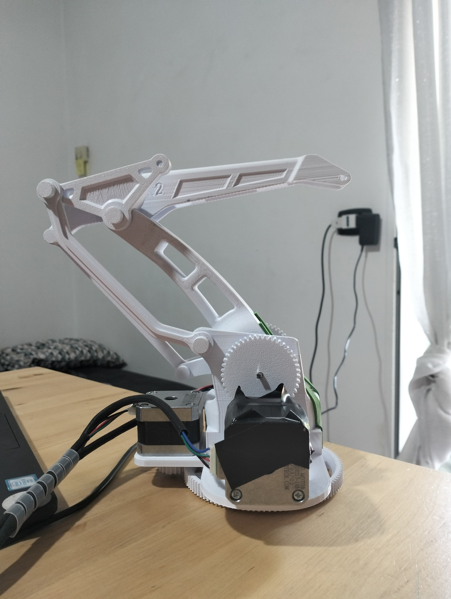
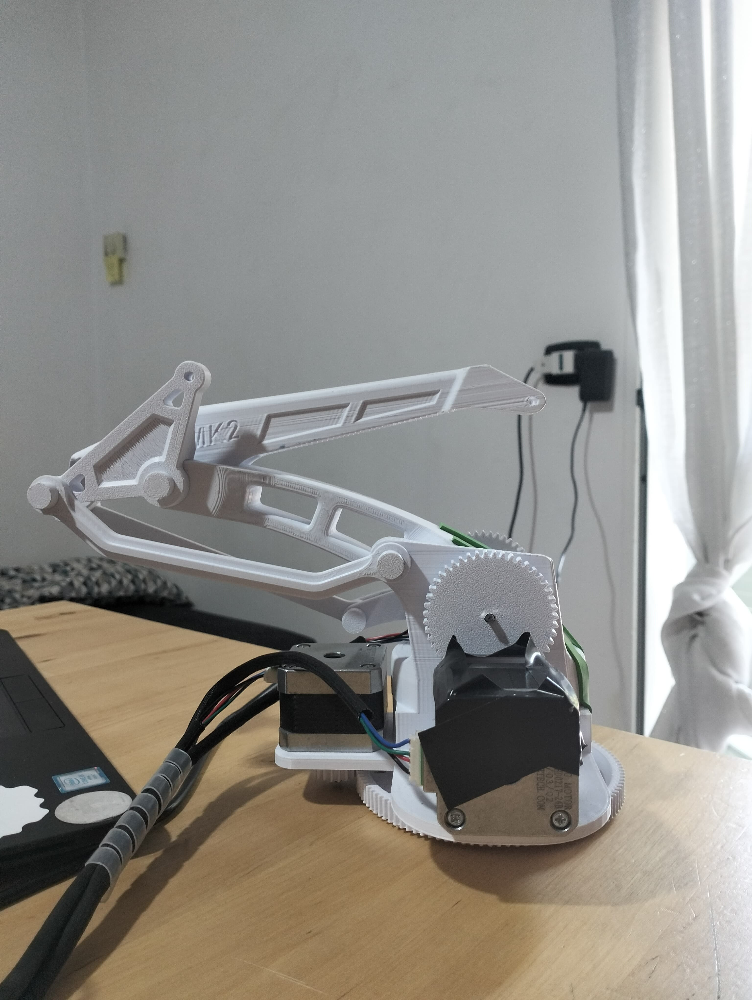
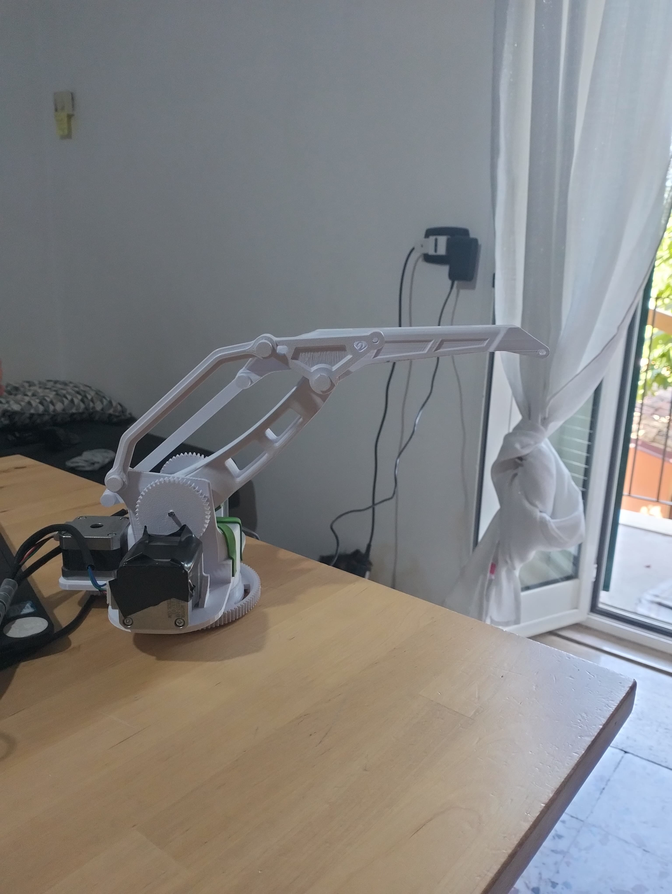

# 🤖 Braccio Robotico con Arduino

## 🔧 Introduzione

Questo progetto nasce da un’idea personale, realizzato interamente in autonomia con l’obiettivo di costruire un **braccio robotico a 3 gradi di libertà** utilizzando **stampa 3D** e componenti elettronici a bassissimo costo. Il sistema è pensato per essere controllato in **tempo reale** tramite diverse interfacce.

---

## 🛠️ Struttura Meccanica

- **Gradi di libertà:** 3
- **Base:** rotazione completa a 360° sull'asse verticale  
- **Primo snodo:** movimento fino a 180°  
- **Secondo snodo:** movimento angolare variabile, condizionato dall’orientamento del braccio

**Materiale:** PLA (Polylactic Acid), stampato in 3D  
**Modelli CAD:** scaricati da [Thingiverse](https://www.thingiverse.com/)  
**Trasmissione del moto:** giunti con ingranaggi e riduttori meccanici per aumentare la coppia disponibile

---

## ⚙️ Componenti Elettronici

- **Microcontrollore:** Arduino Uno €20
- **Motori:** 3 × motori stepper NEMA17 €15 - €30
- **Driver motori:** 3 × DRV8825 €3
- **Scheda di controllo:** CNC Shield V3 per Arduino €5  
- **Alimentazione:** 12V tramite alimentatore esterno

### Totale: ~ €50

---

## 🖥️ Sistema di Controllo e Software

Il braccio è controllabile in **tempo reale** attraverso due modalità principali:

### 1. 🕹️ Controller PlayStation 5

- Acquisizione degli input tramite `pygame`
- Invio comandi seriali diretti ad Arduino

### 2. 🌐 Interfaccia Web (Flask)

- Applicazione web in Python con `Flask`
- Controllo del braccio tramite browser locale

### Architettura Software

**Firmware Arduino**
- Linguaggio: C++
- Nessuna libreria esterna utilizzata

**Client PC**
- Linguaggio: Python
- Librerie principali: `serial` (comunicazione), `pygame` (input controller)

---

## 🧪 Test e Risultati

✅ Il braccio risponde ai comandi con **latenza minima** e **movimenti fluidi**  
✅ La precisione dei motori è molto alta, grazie ai driver che permettono microstep di 1/32 di step e per fare un giro completo dobbiamo fare 64 step, 64*32 = 2048 step per fare un giro completo, quindi otteniamo un'accuratezza di ~0.176 gradi

### Limiti attuali:

- ❌ Assenza di feedback di posizione (encoder/potenziometri)
- ❌ Vincoli meccanici sul terzo snodo per geometria attuale
- ❌ Nessun finecorsa → minor affidabilità in sessioni lunghe

---

## 🚀 Espansioni Future

- ✅ Installazione di finecorsa o sensori di posizione  
- ✅ Aggiunta di ulteriori gradi di libertà (es. **pinza terminale**)  
- ✅ Integrazione di un modulo wireless che permetta di lavorare in modo autonomo (ESP32 o modulo Bluetooth 5.0)  
- ✅ Modalità autonoma programmabile (tramite cinematica inversa)
---

## 📸 Demo

### 📷 Foto del Braccio

### 🎥 Video dimostrativo (cliccare sull'immagine per aprire)

